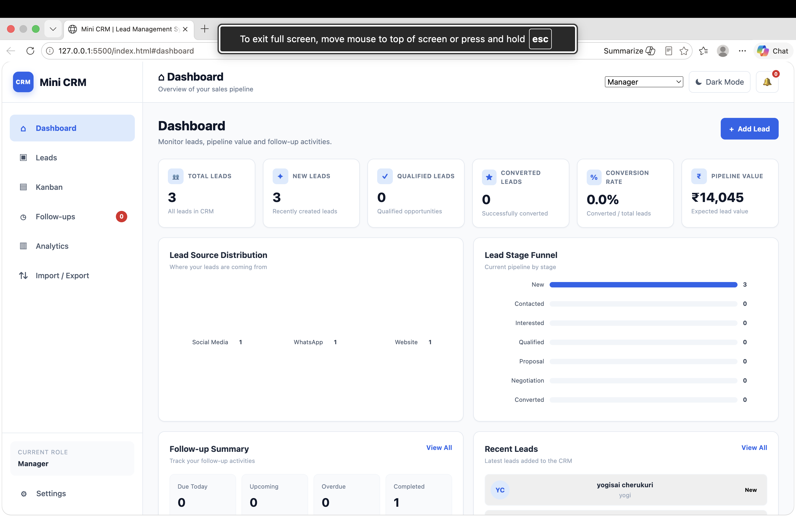
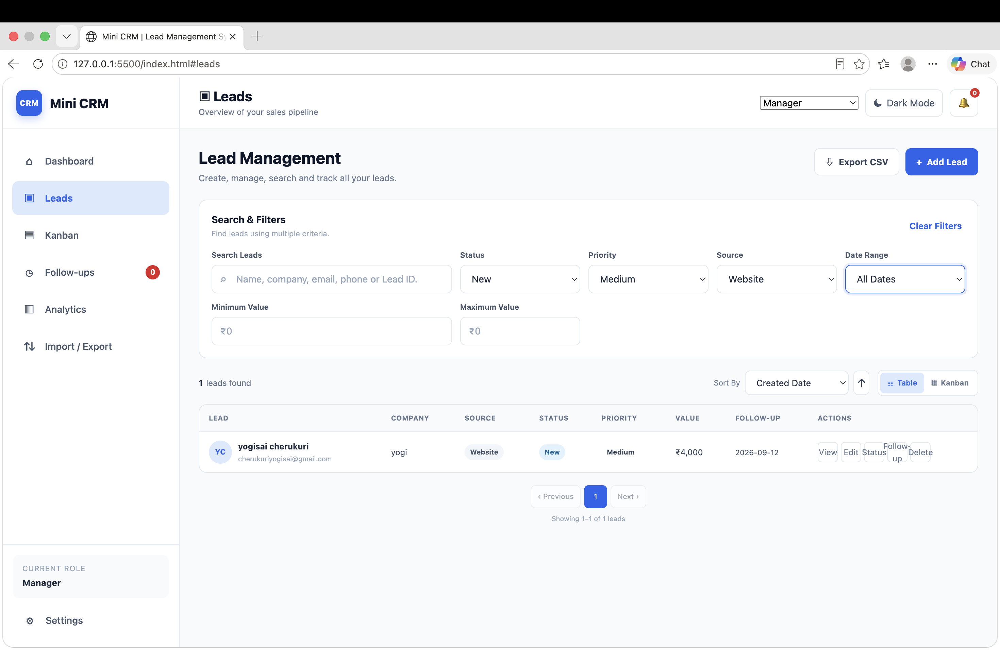
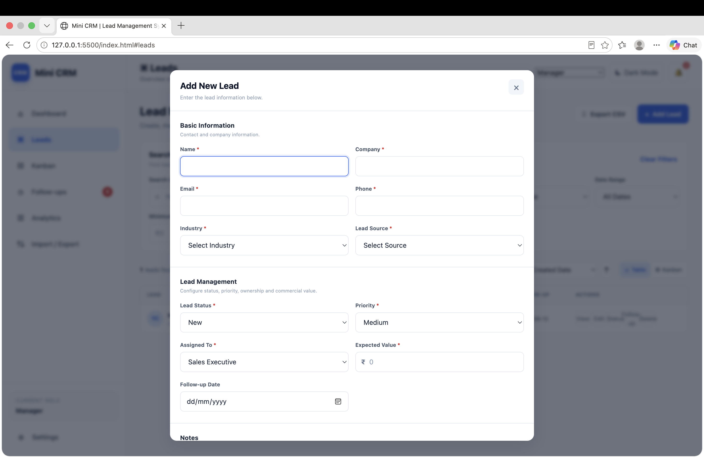
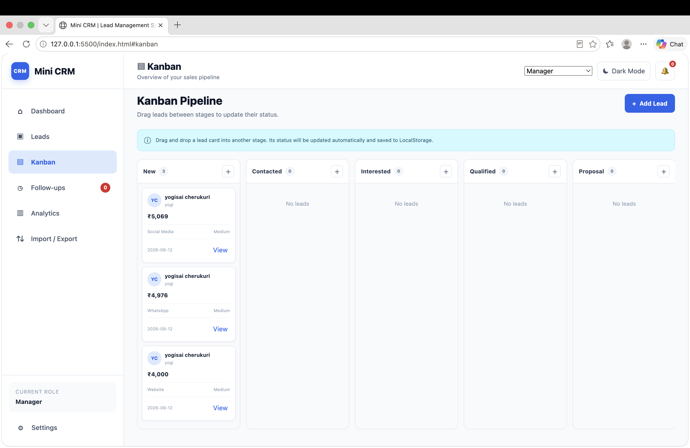
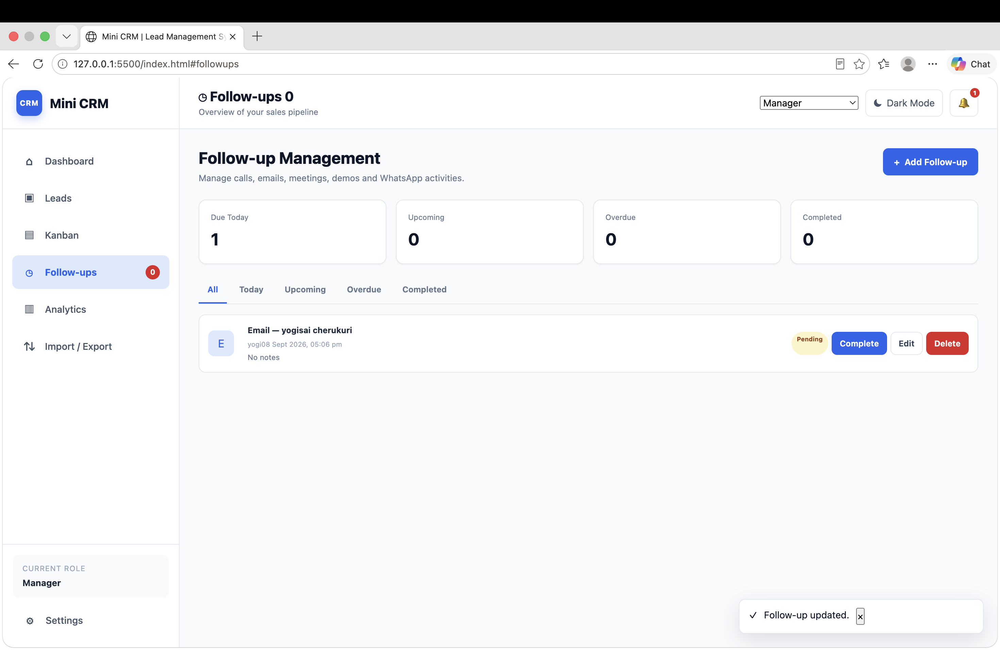
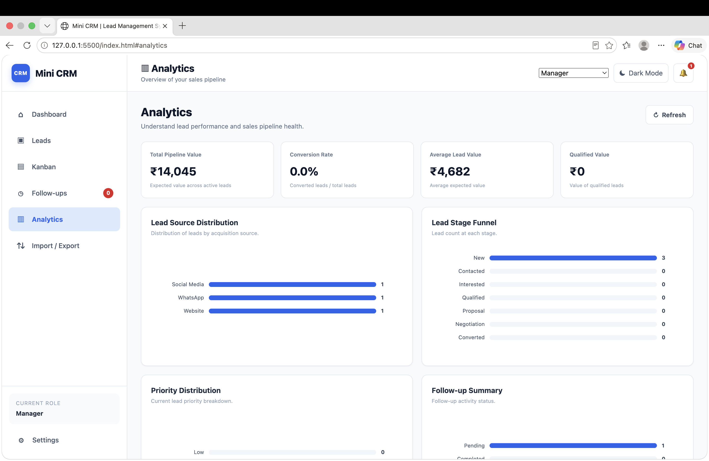
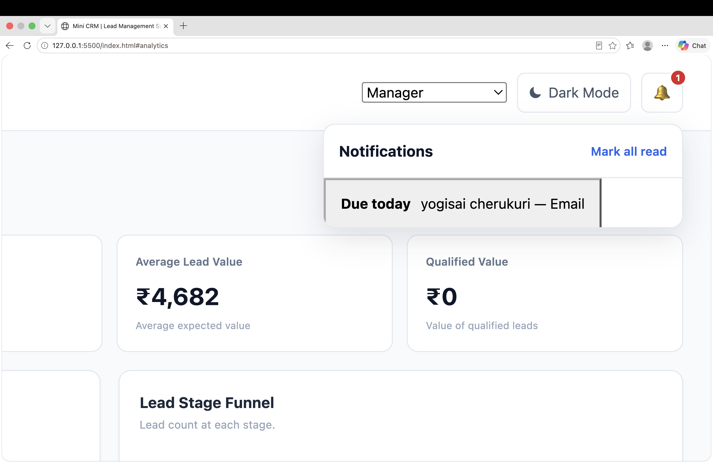
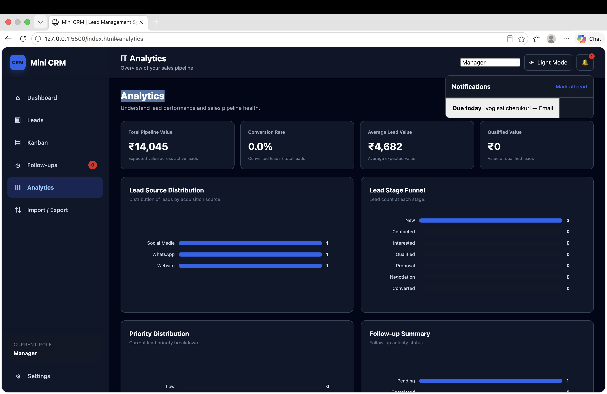
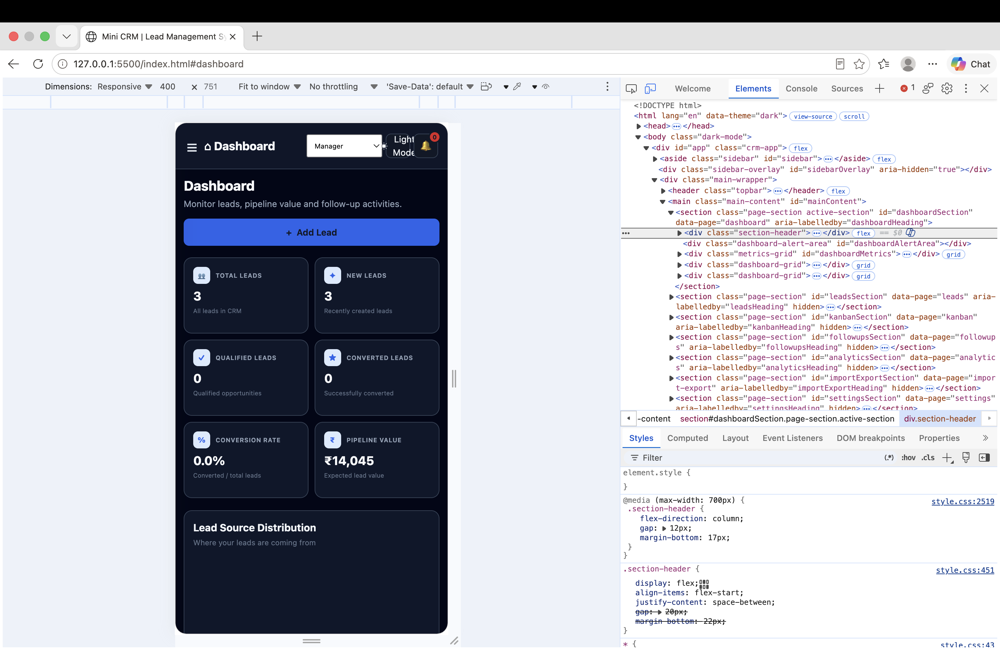

# Mini CRM & Lead Management System

## Project Overview

The Mini CRM & Lead Management System is a responsive web-based Customer Relationship Management application designed to help sales teams manage leads, track follow-ups, monitor lead stages, and analyze sales performance from a single interface.

The project is developed as an Advanced Web Development Internship capstone using HTML5, CSS3, and JavaScript (ES6+).

The system replaces manual spreadsheet-based lead tracking with a structured CRM interface that supports lead management, follow-up management, searching, filtering, sorting, pagination, Kanban workflow, drag-and-drop status updates, analytics, CSV import/export, role simulation, and LocalStorage persistence.

## Business Problem

Growing businesses receive leads from multiple sources such as websites, WhatsApp, social media, email, phone calls, and referrals.

Managing these leads manually using spreadsheets can make it difficult to maintain updated lead information, track sales stages, manage follow-ups, identify overdue activities, and analyze sales performance.

The Mini CRM & Lead Management System provides a centralized platform where sales representatives can manage leads, update lead stages, schedule follow-ups, and monitor their assigned leads.

Managers can view overall CRM information, assign leads, access analytics, export data, and monitor sales performance.

## Project Objectives

The main objectives of this project are:

- Build a multi-module CRM business application.
- Implement structured JavaScript data models.
- Implement complete CRUD operations for leads and follow-ups.
- Provide lead searching, filtering, sorting, and pagination.
- Implement Table View and Kanban View.
- Implement drag-and-drop lead stage updates.
- Persist leads, follow-ups, activities, notifications, and preferences using LocalStorage.
- Provide follow-up tracking and notifications.
- Provide dashboard analytics and visual summaries.
- Support CSV import and export.
- Implement data validation and error handling.
- Implement role-based UI simulation.
- Create a responsive and accessible user interface.
- Handle edge cases and invalid input.
- Provide project documentation and testing information.

## Live Demo

[View Live CRM Application]( https://yogendra9999.github.io/Mini-CRM-Lead-Management-System/)

## Screenshots

### Dashboard


### Leads Management


### Lead Form


### Kanban Board


### Follow-ups


### Analytics


### Notifications


### Dark Mode


### Mobile Responsive View



## Features

### Dashboard

The Dashboard provides an overview of the CRM with:

- Total Leads
- New Leads
- Qualified Leads
- Converted Leads
- Lead Conversion Rate
- Expected Pipeline Value
- Lead Source Breakdown
- Follow-up Summary

### Lead Management

Users can create and manage leads using the following information:

- Lead ID
- Name
- Company
- Email
- Phone
- Industry
- Lead Source
- Lead Status
- Priority
- Assigned To
- Expected Value
- Follow-up Date
- Notes
- Created Date
- Updated Date

### Lead CRUD Operations

The application supports complete CRUD operations:

- Create new leads
- View lead information
- Edit existing leads
- Delete leads
- Update lead status
- Assign leads to sales executives

### Lead Status Pipeline

The CRM supports the following lead stages:

- New
- Contacted
- Interested
- Qualified
- Proposal
- Negotiation
- Converted
- Lost
- Rejected

### Search

Leads can be searched using:

- Lead ID
- Name
- Company
- Email
- Phone

### Filtering

The application supports multiple lead filters:

- Status
- Priority
- Lead Source
- Today
- This Week
- This Month
- Custom Date Range
- Minimum Expected Value
- Maximum Expected Value

Multiple filters can be applied together.

### Sorting

Leads can be sorted by:

- Expected Value
- Created Date
- Follow-up Date
- Name
- Company

Sorting supports ascending and descending order.

### Pagination

The lead list supports pagination with:

- 20 leads per page
- Previous button
- Next button
- Page numbers
- Current result range
- Total lead count

### Table View

The Table View displays leads in a structured table containing important lead information and action controls.

### Kanban View

The Kanban View provides a visual representation of the sales pipeline.

Leads are displayed as cards according to their current stage.

Users can drag a lead from one stage to another.

When a lead is dropped into a new stage, its status is automatically updated and persisted.

### Drag and Drop

The drag-and-drop workflow is:

Drag Lead → Drop into Stage → Update Status → Save Data → Refresh UI

This allows sales representatives to manage the sales pipeline visually.

## Follow-Up Management

The CRM provides a dedicated Follow-ups module.

Users can create follow-ups with:

- Lead
- Date
- Time
- Type
- Status
- Notes

Supported follow-up types include:

- Call
- Email
- Meeting
- Demo
- WhatsApp

Follow-up statuses include:

- Pending
- Completed
- Cancelled

### Follow-Up Tracking

The application tracks:

- Upcoming follow-ups
- Due-today follow-ups
- Overdue follow-ups
- Completed follow-ups
- Cancelled follow-ups

## Notifications

The application provides notifications for important follow-up activities.

Notifications can identify:

- Follow-ups due today
- Overdue follow-ups

Notification read status is also stored locally.

## Analytics

The Analytics module provides visual summaries of CRM data.

It includes:

- Expected Pipeline Value
- Conversion Rate
- Average Lead Value
- Qualified Lead Value
- Lead Source Distribution
- Lead Stage Funnel
- Priority Distribution
- Follow-Up Summary

Analytics are calculated from the current CRM data.

## LocalStorage Persistence

The application uses the browser LocalStorage API to persist application data.

The following information is stored:

- Leads
- Follow-ups
- User Preferences
- Lead Activities
- Read Notifications

Data remains available after refreshing the browser.

For example:

Add Lead → Save to LocalStorage → Refresh Browser → Lead Remains Available

Theme and lead-view preferences are also persisted.

## CSV Import and Export

### CSV Export

Users can export lead data into a CSV file.

The exported information includes:

- Lead ID
- Name
- Company
- Email
- Phone
- Industry
- Source
- Status
- Priority
- Assigned To
- Expected Value
- Follow-up Date
- Notes
- Created Date

### CSV Import

Users can import lead information from CSV files.

The import process includes:

1. Select CSV file
2. Read the file
3. Parse CSV data
4. Normalize records
5. Validate records
6. Import valid records
7. Report invalid records

Invalid records are reported without preventing valid records from being imported.

## Data Validation

The application validates user input before saving lead information.

Validation includes:

- Required fields
- Email format
- Phone format
- Industry
- Lead Source
- Lead Status
- Priority
- Assigned To
- Expected Value
- Follow-up Date
- Duplicate lead detection

Invalid information is rejected and an appropriate message is displayed.

## Role-Based UI

The application provides two simulated user roles.

### Manager

The Manager can:

- View all leads
- Access analytics
- Assign leads
- Delete leads
- Export data

### Sales Executive

The Sales Executive can:

- View assigned leads
- Add leads
- Edit leads
- Update lead status
- Manage follow-ups

The role system is implemented as a frontend UI simulation and does not provide secure backend authentication.

## Theme and Preferences

The application supports:

- Light Mode
- Dark Mode

The selected theme is stored in LocalStorage and remains active after refreshing the browser.

The application also stores the selected lead view preference.

## Lead Activity Timeline

The CRM provides an activity timeline for lead-related activities.

The timeline can display activities such as:

- Lead creation
- Lead updates
- Status changes
- Assignment changes
- Follow-up activities

This provides a chronological view of lead activity.

## Responsive Design

The application is responsive and designed for:

- Desktop
- Laptop
- Tablet
- Mobile

The interface adapts the following components for different screen sizes:

- Sidebar
- Dashboard cards
- Forms
- Tables
- Kanban board
- Analytics
- Modals
- Filters
- Action controls

## Accessibility

Accessibility features include:

- Semantic HTML
- Form labels
- ARIA attributes
- Accessible buttons
- Dialog labels
- Screen-reader support
- Keyboard-friendly controls
- Responsive layouts
- Clear visual hierarchy

## Technology Stack

### Frontend

- HTML5
- CSS3
- JavaScript ES6+

### Browser APIs

- DOM API
- LocalStorage API
- FileReader API
- Drag and Drop API

### JavaScript Concepts

- ES6 Modules
- Functions
- Arrays
- Objects
- Array Methods
- DOM Manipulation
- Event Handling
- Form Validation
- Date Handling
- CSV Processing

## Project Architecture

The project follows a modular JavaScript architecture.

```text
Mini CRM & Lead Management System
│
├── index.html
│
├── css/
│   └── style.css
│
├── js/
│   ├── app.js
│   ├── data.js
│   ├── leads.js
│   ├── followups.js
│   └── utils.js
│
├── screenshots/
│
├── README.md
└── test-cases.xlsx
